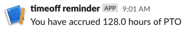

# Slack Reminder

Get notified in Slack when your accrued hours reaches a certain threshold.

> 


## Setup

1. [Create a new Slack App][slack-app] and enable the Incoming Webhook feature.
1. Save `timeoff-reminder.py` and update the webhook URL and threshold value.
1. Schedule jobs in `crontab -e`. Semi-monthly example:
    ```sh
    # on the 15th of the month at 12pm
    0 12 15 * * python timeoff-reminder.py

    # on the last day of the month at 12pm
    0 12 28-31 * * [ `date +\%d` -eq `cal | xargs echo | awk '{print $NF}'` ] && python timeoff-reminder.py
    ```


[slack-app]: https://api.slack.com/messaging/webhooks
